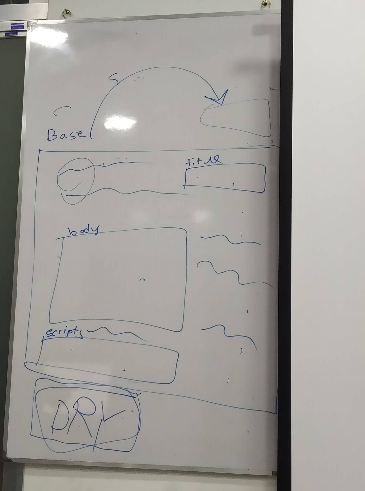

# How to Sync with Fork Base Repository - Git & Github/BitBucket/GitLab etc.
If we create a repo using `git clone` then we already get some setup for free:
* Remote repo URL
* Default working branch

But if we start our repo with `git init` then we gotta setup them manually. To do that we run command like below.
```shell script
$ git remote add origin <ssh/https git repo url>
```

Example:
```shell script
$ git remote add origin https://github.com/SabujXi/LibraryManagementSystem-Django.git
```

**What is *origin*?**

It is nothing but a name refer to a remote repo. But, it is a common convention to name the default remote repo to **origin**

Now the point is **We can add multiple remote repo url.**

So, let's add a remote repo named **forkbase**

Now go to your command line and run the following commands.

```shell script
$ git remote add forkbase https://github.com/SabujXi/LibraryManagementSystem-Django.git
```

And then to get all the changes from the remote repository run the following command(s)
```shell script
$ git fetch <remote repo name>
```

So, in our case:
```shell script
$ git fetch forkbase
```

Go to your repo and you will see no changes. Because it is sitting there as a ghost waiting for your next spell. Let's take the wand and spell the next spell.
```shell script
$ git merge <remote name/branch name>
```
Example:
```shell script
$ git merge forkbase/master
```

Now to to your working directory to see what happened.

Magic! `notes` are there.

## FAQs
what is the difference between `pull` and `fetch` and when do we use `pull` and `fetch`?




--------
This text is copyrighted to Md. Sabuj Sarker (md.sabuj.sarker@gmail.com) - no part of it can be used/copied without explicit permission from him.
